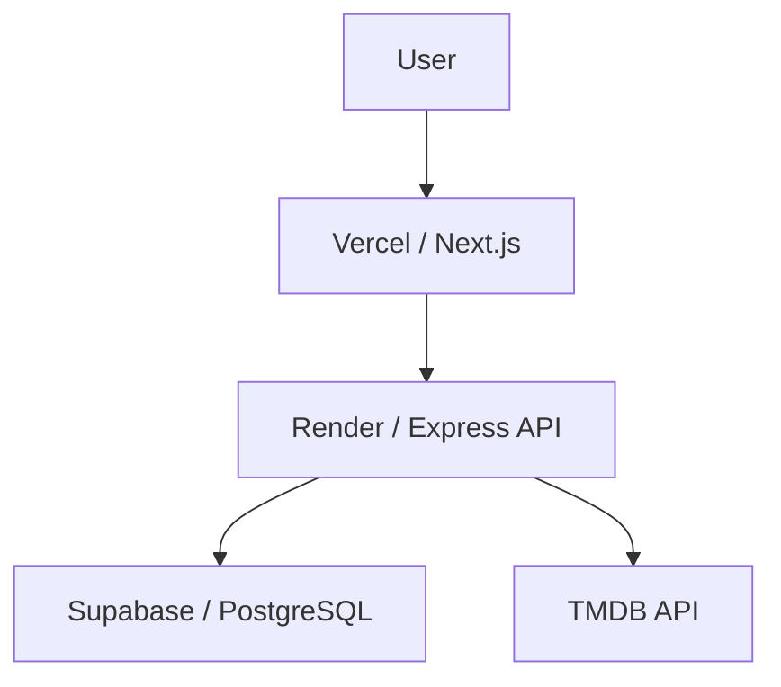

# MiniMovie

MiniMovie is a curated film discovery and personal film journal. It helps you find one film to watch, explore a small set of editorial lists, and keep favourites and reviews of your own.

**Live Demo:** [https://mini-movie-phi.vercel.app](https://mini-movie-phi.vercel.app)

**Repository:** [https://github.com/Shouldgooo/mini-movie](https://github.com/Shouldgooo/mini-movie)

## Overview

MiniMovie is not a TMDB clone. It does not try to browse the entire catalogue. The product is a small, editorial layer over TMDB metadata: one daily film, five curated Discover rankings, and a set of Collections about movements, filmmakers, and cinema culture.

Users can register, sign in, favourite films, write reviews, and manage that journal on the My page. The UI is bilingual (English and Chinese) and follows a black-and-white cinematic editorial style.

This repository is a junior / graduate portfolio project: the architecture stays readable, the main API flows are covered by automated tests, and the app is deployed as three separate services.

## Features

- **Daily Film** — one recommendation per UTC day on `/`
- **Discover** — five curated rankings with region and year/era filters
- **Collections** — editorial topics (movements, directors, Chinese-language cinema, aesthetics/culture), including a sourced mainland-restriction collection
- **Authentication** — register, login, and JWT-protected account routes
- **Favourites** — save a film; duplicates return `409`
- **Reviews** — create, edit, and delete your own review; one review per user per film
- **My Journal** — profile, favourites, and reviews
- **English / Chinese UI** — `中文 | EN` in the navbar; first visit defaults to English; the choice is stored in `localStorage`

## Tech Stack

### Frontend

- Next.js 16
- React 19
- TypeScript
- Tailwind CSS

### Backend

- Node.js
- Express 5
- TypeScript
- REST API
- JWT authentication
- bcrypt password hashing
- Zod request validation
- Helmet
- CORS
- Rate limiting on auth routes

### Database

- PostgreSQL
- Prisma 8 (contract-based client)

### Infrastructure / Deployment

- Vercel — Next.js frontend
- Render — Express API (Docker)
- Supabase — PostgreSQL
- Docker and Docker Compose for local containers
- GitHub Actions for CI

### Testing / Tooling

- Vitest and Supertest (backend integration tests)
- ESLint (frontend)
- `tsc --noEmit` (backend lint/build)

## Architecture

The browser never calls TMDB. Movie metadata is fetched and normalized by the Express API. PostgreSQL stores users, favourites, reviews, and a local movie row when someone favourites or reviews a TMDB title.



## Project Structure

```text
mini-movie/
  frontend/     Next.js App Router UI
  backend/      Express API, Prisma 8, tests
  docker-compose.yml
  .github/workflows/ci.yml
```

| Path | Role |
|---|---|
| `frontend/src/app/` | Routes: `/`, `/discover`, `/collections`, `/login`, `/register`, `/my` |
| `frontend/src/lib/api.ts` | API base URL (`NEXT_PUBLIC_API_URL`) and fetch helper |
| `backend/src/routes/` | Auth, movies, collections, favourites, reviews, health |
| `backend/src/services/` | TMDB client, daily/ranking curation, collections, restriction metadata |
| `backend/src/data/collections/` | Editorial collection catalogue |
| `backend/src/prisma/` | Prisma 8 contract and database client |
| `backend/tests/` | Vitest + Supertest tests |

## API / Backend

Public discovery:

- `GET /api/health`
- `GET /api/movies/daily`
- `GET /api/movies/rankings/:kind` — `today`, `classic`, `recent`, `hidden-gems`, `top-rated`, with optional `region` / `year` / `decade`
- `GET /api/collections` and `GET /api/collections/:slug`

Account:

- `POST /api/auth/register`, `POST /api/auth/login`, `GET /api/auth/me`
- Favourites and reviews require `Authorization: Bearer <token>`
- Identity is taken from the verified JWT, not from a client-supplied `userId`

Typical errors: `400` validation, `401` auth, `404` not found, `409` duplicate, `429` auth rate limit, `502` TMDB unavailable.

## Local Development

Requirements: Node.js 22+, npm, PostgreSQL 15+ (developed against PostgreSQL 17).

### 1. Database

```bash
createdb minimovie
cp backend/.env.example backend/.env
# set DATABASE_URL, JWT_SECRET, CORS_ORIGIN, PORT, TMDB_ACCESS_TOKEN
cd backend
npx prisma db init
```

`npx prisma db init` creates tables from the Prisma 8 contract. `npm run seed` is optional and provides sample data for local development. Daily Film and Discover come from curated TMDB results, not from seed rows.

### 2. Backend

```bash
cd backend
npm install
npm run dev
```

Health check: [http://localhost:4000/api/health](http://localhost:4000/api/health)

### 3. Frontend

```bash
cp frontend/.env.example frontend/.env.local
# NEXT_PUBLIC_API_URL=http://localhost:4000
cd frontend
npm install
npm run dev
```

UI: [http://localhost:3000](http://localhost:3000)

Get a TMDB API Read Access Token from [TMDB API settings](https://www.themoviedb.org/settings/api). Put it only in the backend env file. Never prefix it with `NEXT_PUBLIC_`.

### Docker Compose (optional)

Do not run Compose and the local Node processes on ports 3000/4000 at the same time. Compose publishes Postgres on **5433** by default.

```bash
cp .env.example .env
# set POSTGRES_PASSWORD, JWT_SECRET, TMDB_ACCESS_TOKEN
docker compose up --build
```

The backend image starts the API only; it does not run `prisma db init` or seed. Initialise the schema separately if the Compose database is empty.

## Testing

Backend (uses a real PostgreSQL database from `backend/.env`; TMDB HTTP is stubbed):

```bash
cd backend
npm run lint
npm run build
npm test
```

Frontend:

```bash
cd frontend
npm run lint
npm run build
```

GitHub Actions runs the same checks on `main` and pull requests. Backend CI starts PostgreSQL 17, runs `npx prisma db init -y`, then lint, build, and tests.

## Deployment

Production is split across three services:

| Service | Host |
|---|---|
| Next.js frontend | Vercel |
| Express API | Render (Docker, `backend/` context) |
| PostgreSQL | Supabase |

The frontend is built with `NEXT_PUBLIC_API_URL` pointing at the public API origin. The API uses `DATABASE_URL`, `JWT_SECRET`, `CORS_ORIGIN`, `PORT`, and `TMDB_ACCESS_TOKEN`. Schema for an empty production database is created with `npx prisma db init`, not with seed data.

## Engineering Decisions

- **TMDB stays on the server.** The token and raw TMDB responses are not sent to the browser. The frontend only sees MiniMovie’s normalized movie objects.
- **Curation over catalogue.** Daily Film and Discover are heuristic lists (live-action narrative cinema, region/year filters). Collections are editorial TypeScript data plus TMDB ids, not a dump of TMDB Popular.
- **JWT for a small REST API.** Protected routes verify the token and read `userId` from it. Passwords are stored as bcrypt hashes only.
- **Postgres for journal data.** Favourites and reviews persist in PostgreSQL. Favouriting or reviewing a TMDB title upserts a local `Movie` row by `externalId`.
- **Clear service boundaries.** Vercel serves the UI, Render serves the API, Supabase hosts the database. CORS origins come from `CORS_ORIGIN`.
- **Prisma 8 contract API.** Queries use `db.orm.public.Model.where().first()` / `.create({ ... })`, not the older `findMany()` client.

This V1 stores the JWT in `localStorage` so the Next.js client can send `Authorization` headers. That is a simplified choice; HttpOnly cookies would reduce XSS exposure in a later design.

## Disclaimer

This product uses the TMDB API but is not endorsed or certified by TMDB.
