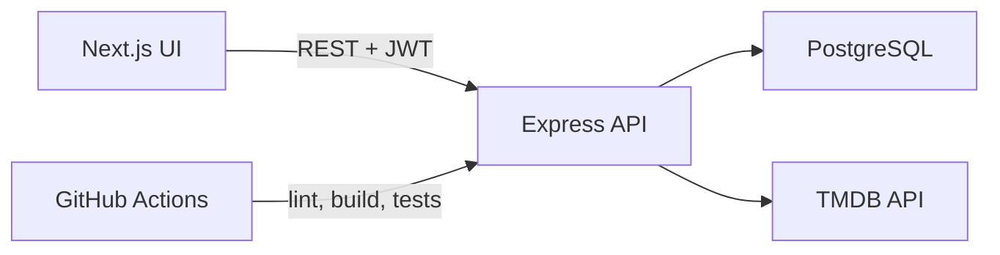

# MiniMovie

MiniMovie is a curated movie journal focused on live-action narrative cinema: arthouse, independent, auteur and international films.

The product has three discovery layers:

1. **Daily Recommendation** (`/`) — one film per UTC day.
2. **Discover** (`/discover`) — five curated ranking systems, with region and year/era filters.
3. **Collections** (`/collections`) — editorial exploration of film movements, filmmakers, and cinema culture/history.

Collections are not rankings. Numbering is reading order, not a claim that film 01 is better than film 02.

TMDB supplies external movie metadata. MiniMovie applies its own lightweight heuristic curation for:

- a single daily recommendation
- five Discover rankings: 今日热度, 经典必看, 近年佳作, 冷门佳作, 高分电影
- optional region and year/era filters on those rankings

Editorial Collections sit beside those rankings. Membership is curated by MiniMovie; ordinary title, poster, year, overview, director and country metadata still come from TMDB.

PostgreSQL stores application-specific data such as users, favourites, reviews, and locally referenced movies.

It is built as a Junior / Graduate software developer portfolio project: the scope stays readable, and the main user flows are covered by automated API tests.

## Features

- JWT authentication (register, login, current user)
- One daily film recommendation
- Five curated rankings on Discover, with region and year/era filters
- Editorial Collections of film movements, directors, and cinema culture
- Favourites with duplicate protection
- Reviews with create, edit, delete, ownership checks, and duplicate protection
- Protected personal data on the My page
- Responsive black-and-white editorial UI in Chinese
- PostgreSQL persistence for users, favourites, reviews, and locally referenced movies

This version does **not** include a registration page, search UI, genre browsing, pagination, social features, or production deployment.

## Tech stack

### Frontend

- Next.js 16
- React 19
- TypeScript
- Tailwind CSS

### Backend

- Node.js
- Express
- TypeScript
- Prisma 8 (new ORM API)
- PostgreSQL
- JWT
- bcrypt

### Engineering

- REST API
- Docker Compose
- Vitest + Supertest integration tests
- GitHub Actions CI

## Architecture overview

```text
Browser (Next.js, port 3000)
        |
        | JSON + Authorization: Bearer <user JWT>
        v
Express API (port 4000)
        |                          |
        | user data                | movie catalogue
        v                          v
PostgreSQL (Prisma 8 ORM)     TMDB API
```

- The frontend is a Next.js App Router UI. It never talks to TMDB directly and never receives `TMDB_ACCESS_TOKEN`.
- The backend is a small Express app. Identity comes from a verified JWT, never from a client-supplied `userId`.
- TMDB is the external movie catalogue. MiniMovie does not mirror TMDB's popular page. A small backend curation layer scores and filters candidates toward live-action narrative cinema, especially drama, romance, mystery, international and longer-lasting films. Genre is only a heuristic; TMDB has no reliable `arthouse=true` field.
- PostgreSQL stores MiniMovie users, favourites, reviews, and a local `Movie` row when someone favourites or reviews a TMDB title.
- Prisma 8 uses the contract-based client: `db.orm.public.Model.where(...).first()` / `.create({ ... })`. This project does **not** use the older `findMany()` / `create({ data })` client API.



## Project structure

```text
mini-movie/
  frontend/                 Next.js app
    src/app/                Pages: home, discover, collections, login, my
    src/components/         Navbar, footer, home, discover, collections, movie poster
    src/lib/api.ts          API base URL + fetch helper
  backend/                  Express API
    src/app.ts              App setup, CORS, helmet, rate limit
    src/routes/             Auth, movies, collections, favourites, reviews, health
    src/services/tmdb.ts    TMDB HTTP client and response normalization
    src/services/curation.ts  Daily pick and ranking heuristics
    src/services/collections.ts  Editorial collection summaries and detail
    src/services/restricted-mainland.ts  Restricted-mainland metadata enrichment
    src/data/collections/   Curated collection catalogue (TMDB ids + editorial copy)
    src/data/restricted-films.ts  Curated restriction entries and sources
    src/middleware/         JWT auth middleware
    src/lib/                Validation, user sanitization, local movie upsert
    src/prisma/             Prisma 8 contract and database client
    tests/                  Vitest + Supertest integration tests
    scripts/seed.ts         Inserts a few movies when missing
  docker-compose.yml
  .github/workflows/ci.yml
```

## Database model

Four tables:

| Model | Purpose |
|---|---|
| `User` | Account data. Passwords are stored only as `passwordHash`. |
| `Movie` | Local copy of a TMDB title, created when a user favourites or reviews it (`externalId` stores the TMDB id). |
| `Favourite` | Unique per `(userId, movieId)`. Cascade delete with user/movie. |
| `Review` | Unique per `(userId, movieId)`. Users can update/delete only their own review. |

`posterUrl` is optional. When it is `null` or fails to load, the UI shows a placeholder instead of a broken image.

## Curation

MiniMovie does not treat TMDB Popular or Trending as the product catalogue.

The V1 product is **live-action narrative cinema**. Candidate films come from TMDB (`trending/day` and `discover/movie`). The backend then applies a readable heuristic in `backend/src/services/curation.ts`:

- keep drama / romance / mystery / history / war as preferred signals
- exclude Animation, Documentary and TV Movie
- drop likely mainstream franchises using genre (action + adventure, family) and a small title blocklist
- reduce likely biopics with a title heuristic (`biography`, `biopic`, `传记`, and similar). TMDB has no reliable Biography genre, so this is approximate
- require a minimum vote average, and a meaningful vote count for “high score” lists
- for 今日热度, keep some current attention via popularity, after curation
- for 经典必看, prefer older films with a higher vote average and vote count
- for 近年佳作, prefer well-rated curated films from about the last five years, not just the newest popular releases
- for 冷门佳作, prefer well-rated films with lower popularity / vote exposure, while avoiding tiny-sample obscurities
- for 高分电影, sort by vote average with a minimum vote count so 9–10 scores from a handful of votes do not dominate
- pick 今日推荐 by hashing the UTC date against the curated pool, so the same day stays stable
- Discover can further filter any ranking by region (亚洲 / 欧洲 / 北美 / 拉丁美洲 / 其他) and by year or era. Region uses TMDB origin/production countries; a co-production may match more than one region. Year options are generated from the current calendar year, not hardcoded.

Displayed overviews are normalized in the backend: Chinese overview, then English overview from TMDB details if needed, then `暂无简介`. The frontend never invents descriptions.

These rankings are MiniMovie curated lists informed by TMDB data. They are **not** an objective universal ranking, and they do **not** claim a perfect definition of arthouse cinema or biography.

## Collections

Collections live at `/collections` and `/collections/[slug]`. They are editorial cinema topics: film movements, directors, Chinese-language cinema, and cultural/aesthetic themes.

V1 stores the catalogue as TypeScript data files in `backend/src/data/collections/`. Each collection keeps a slug, bilingual titles and descriptions, category, optional people/period/countries, source links, and a list of TMDB ids. MiniMovie does not store posters or overviews by hand.

The UI language can be switched between 中文 and English (`中文 | EN` in the navbar). First visits default to English. After the user chooses a language, that preference is stored in `localStorage` and is not overwritten by the default. Collection membership and ordinary movie metadata still come from the same records: editorial copy has `zh` / `en` fields, while TMDB supplies titles and overviews in both languages when available.

When a collection is requested:

curated collection data → TMDB ids → existing TMDB service → normalized MiniMovie movie objects → frontend

The frontend never receives the TMDB token or raw TMDB response objects. Favourite and review still upsert the same local `Movie` row by TMDB `externalId`, whether the film was opened from Home, Discover, or Collections.

Director collections only include films that filmmaker directed. Movement membership is conservative: well-established representative works, with copy that can note debated historical boundaries.

## 大陆禁映与受限

「大陆禁映与受限」is now a Collection at `/collections/mainland-restricted`, not a sixth Discover ranking.

The initial candidate list comes from MV CAT’s [《60部国产禁片大盘点》](https://www.mvcat.com/movies/1711.html). That article is a cinephile roundup, **not** an official government register. It mixes films that were reportedly banned, never approved, later released, released after cuts, or listed with uncertain notes. MiniMovie therefore treats it as a candidate source and records different statuses instead of labeling every title “currently banned”.

TMDB supplies ordinary movie metadata after a confident Chinese-title + year match. TMDB does **not** decide censorship status. Entries with a weak or colliding TMDB match are omitted rather than guessed.

Published entries live in `backend/src/data/restricted-films.ts`. Each item stores restriction status, period, current status, factual context, and one or more sources. Article jokes or “被禁原因” copy are not treated as official government reasons.

The collection stores **what happened** separately from **why it happened**. MiniMovie does not infer an official censorship reason unless the cited source supports that reason.

AI or rules may later help find *candidates*. V1 does not call an LLM at runtime, and it does not auto-publish classified films. The pipeline is:

candidate discovery → evidence/source verification → curated dataset → TMDB metadata enrichment → MiniMovie API → frontend

## API endpoints

| Method | Path | Auth | Success | Notes |
|---|---|---|---|---|
| `GET` | `/api/health` | No | 200 | Health check |
| `GET` | `/api/movies` | No | 200 | TMDB popular movies, or search when `?query=` is set (API only; V1 UI does not expose search) |
| `GET` | `/api/movies/daily` | No | 200 | One curated daily recommendation, stable for the UTC calendar day |
| `GET` | `/api/movies/rankings/today` | No | 200 | Curated “今日热度”. Optional `region`, `year` or `decade` |
| `GET` | `/api/movies/rankings/classic` | No | 200 | Curated “经典必看”. Same optional filters |
| `GET` | `/api/movies/rankings/recent` | No | 200 | Curated “近年佳作”. Same optional filters |
| `GET` | `/api/movies/rankings/hidden-gems` | No | 200 | Curated “冷门佳作”. Same optional filters |
| `GET` | `/api/movies/rankings/top-rated` | No | 200 | Curated “高分电影”. Same optional filters |
| `GET` | `/api/movies/restricted-mainland` | No | 200 | Restricted-mainland dataset (compatibility). Optional `year` or `decade`. UI now uses Collections |
| `GET` | `/api/collections` | No | 200 | Editorial collection summaries |
| `GET` | `/api/collections/:slug` | No | 200 | Collection editorial fields plus TMDB-enriched movies. Unknown slug returns 404 |
| `GET` | `/api/movies/:externalId` | No | 200 | Normalized TMDB movie details |
| `GET` | `/api/movies/:movieId/reviews` | No | 200 | Public reviews for a **local** movie id; user objects omit `passwordHash` |
| `POST` | `/api/auth/register` | No | 201 | Validates username, email, password |
| `POST` | `/api/auth/login` | No | 200 | Returns JWT + public user fields |
| `GET` | `/api/auth/me` | Yes | 200 | Current user from JWT |
| `POST` | `/api/favourites` | Yes | 201 | Body: `{ movieId }` or `{ externalId }`. 409 if duplicate |
| `GET` | `/api/favourites` | Yes | 200 | Current user's favourites |
| `DELETE` | `/api/favourites/:movieId` | Yes | 200 | Remove favourite by local movie id |
| `POST` | `/api/reviews` | Yes | 201 | Body: `{ movieId, content }` or `{ externalId, content }`. 409 if duplicate |
| `GET` | `/api/reviews/me` | Yes | 200 | Current user's reviews |
| `PUT` | `/api/reviews/:reviewId` | Yes | 200 | Update own review |
| `DELETE` | `/api/reviews/:reviewId` | Yes | 200 | Delete own review |

Typical error statuses: `400` validation (including invalid ranking `region` / `year` / `decade`), `401` missing/invalid/expired token, `404` not found, `409` duplicate, `429` auth rate limit, `502` TMDB unavailable, `500` unexpected server error.

Ranking filters are MiniMovie query parameters, not raw TMDB syntax. Examples:

- `/api/movies/rankings/today?region=asia&year=2026`
- `/api/movies/rankings/classic?region=asia&decade=1990`
- `/api/movies/rankings/recent?year=2010s`

## Environment variables

Copy the example files. Never commit real `.env` or `.env.local` files.

### Backend `backend/.env`

```bash
cp backend/.env.example backend/.env
```

| Variable | Purpose |
|---|---|
| `DATABASE_URL` | PostgreSQL connection string (Postgres 15+) |
| `JWT_SECRET` | Secret used to sign/verify JWTs |
| `CORS_ORIGIN` | Allowed frontend origin, e.g. `http://localhost:3000` |
| `PORT` | API port, default `4000` |
| `TMDB_ACCESS_TOKEN` | TMDB API Read Access Token. Get your own from [the TMDB settings page](https://www.themoviedb.org/settings/api). Never expose this to the frontend. |

### Frontend `frontend/.env.local`

```bash
cp frontend/.env.example frontend/.env.local
```

| Variable | Purpose |
|---|---|
| `NEXT_PUBLIC_API_URL` | Browser-facing API origin, e.g. `http://localhost:4000` |

Only this public API origin is exposed to the browser. Backend secrets such as `JWT_SECRET`, `DATABASE_URL`, and `TMDB_ACCESS_TOKEN` must never be prefixed with `NEXT_PUBLIC_`.

### Docker Compose root `.env`

```bash
cp .env.example .env
```

Used only for Compose. It supplies Postgres credentials, `JWT_SECRET`, and `TMDB_ACCESS_TOKEN` without putting secrets in `docker-compose.yml`.

## Local installation

Requirements:

- Node.js 22+
- PostgreSQL 15+ (this project was developed against PostgreSQL 17)
- npm

### 1. Database

Create a local database, then set `DATABASE_URL` in `backend/.env`.

```bash
createdb minimovie
cd backend
npx prisma db init
npm run seed
```

`prisma db init` creates tables from the Prisma contract. `npm run seed` is optional leftover sample data; the homepage and Discover lists come from curated TMDB results.

### 2. Backend

```bash
cd backend
npm install
npm run dev
```

API: [http://localhost:4000/api/health](http://localhost:4000/api/health)

Register a user with curl or an API client, because this portfolio version has login UI but no registration page:

```bash
curl -X POST http://localhost:4000/api/auth/register \
  -H "Content-Type: application/json" \
  -d '{"username":"sherry","email":"sherry@example.com","password":"password123"}'
```

### 3. Frontend

```bash
cd frontend
npm install
npm run dev
```

UI: [http://localhost:3000](http://localhost:3000)

Main flow: open `/` for 今日推荐 → `/discover` for five rankings plus region/year filters → `/collections` for editorial cinema topics → login → favourite / write a review → manage them on My → logout.

## Docker Compose

Docker is optional and does not replace the local Node + Homebrew/Postgres workflow above. Do not run both at the same time on ports 3000/4000.

Postgres inside Compose is published on **5433** by default so it does not collide with a local Postgres on 5432.

```bash
cp .env.example .env
# set POSTGRES_PASSWORD, JWT_SECRET, and TMDB_ACCESS_TOKEN in .env

docker compose up --build
```

Then open [http://localhost:3000](http://localhost:3000). The browser still calls `http://localhost:4000`, because API requests are made from the client.

Stop with `docker compose down`. The Postgres volume `postgres_data` keeps data between restarts.

## Testing

Backend tests are mostly integration tests against a real PostgreSQL database. They use Vitest and Supertest, hit the Express app in-process, and create temporary users/movies that are deleted afterwards. Prisma is not mocked, so unique constraints, JWT auth, and HTTP statuses are real.

TMDB HTTP calls are stubbed in automated tests so CI does not depend on the live TMDB network.

```bash
cd backend
npm test
```

Local tests use the `DATABASE_URL` / `JWT_SECRET` from `backend/.env`. They should be safe to run on the development database because records use unique names and are cleaned up, but a dedicated `minimovie_test` database is also fine.

CI starts PostgreSQL as a service, runs `npx prisma db init`, then `npm test`.

Frontend checks:

```bash
cd frontend
npm run lint
npm run build
```

## Security decisions

- Passwords are hashed with bcrypt. API responses never return `password` or `passwordHash`.
- Protected routes read `userId` from a verified JWT. The frontend never sends `userId`.
- Auth routes are rate limited (`429` after too many attempts). The limiter is skipped when `NODE_ENV=test`.
- Request bodies are validated with Zod (length, email format, positive integer IDs). Strings are trimmed.
- `helmet` is enabled. CORS origins come from `CORS_ORIGIN`.
- Invalid or expired tokens return `401`. Duplicate favourites/reviews return `409`.
- All TMDB requests are made by the Express backend using `process.env.TMDB_ACCESS_TOKEN`. The token is never sent to the browser.

### TMDB attribution

This product uses the TMDB API but is not endorsed or certified by TMDB. You need your own TMDB API Read Access Token for local development and Docker.

### JWT storage

This portfolio V1 stores the JWT in `localStorage` so the client-side Next.js pages can send `Authorization` headers easily. That is a simplified choice. A production app could use HttpOnly cookies or a session-based design to reduce token exposure to XSS, depending on architecture and threat model.

## Screenshots

Add screenshots here after recording the UI:

- Home
- Discover rankings
- Collections
- Login
- My page (favourites and reviews)

## Future improvements

- Registration page
- HttpOnly cookie / session authentication
- Movie detail page
- Refresh tokens and logout on the server
- Stronger password policy and email verification
- End-to-end browser tests
