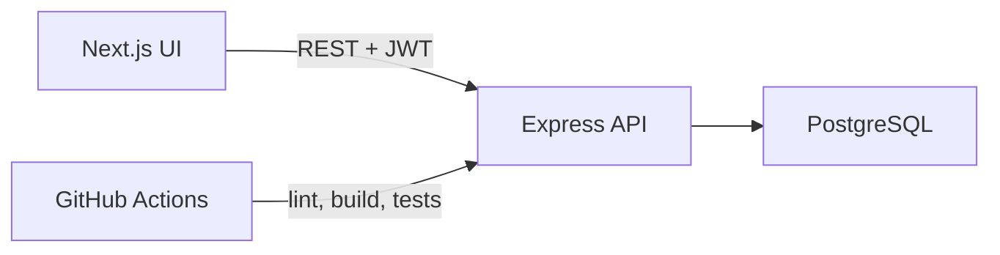

# MiniMovie

MiniMovie is a small full-stack movie journal app. Users can browse a movie list, sign in with JWT authentication, save favourites, and write one review per movie. It is built as a Junior / Graduate software developer portfolio project: the scope stays readable, the data is persisted in PostgreSQL, and the main user flows are covered by automated API tests.

## Features

- JWT authentication (register, login, current user)
- Movie discovery from PostgreSQL
- Favourites with duplicate protection
- Reviews with create, edit, delete, ownership checks, and duplicate protection
- Protected personal data on the My page
- Responsive UI in Chinese
- PostgreSQL persistence

This version does **not** include a registration page, movie detail pages, pagination, social features, or production deployment.

## Tech stack

### Frontend

- Next.js 16
- React 19
- TypeScript
- Tailwind CSS

### Backend

- Node.js
- Express
- TypeScript
- Prisma 8 (new ORM API)
- PostgreSQL
- JWT
- bcrypt

### Engineering

- REST API
- Docker Compose
- Vitest + Supertest integration tests
- GitHub Actions CI

## Architecture overview

```text
Browser (Next.js, port 3000)
        |
        | JSON + Authorization: Bearer <token>
        v
Express API (port 4000)
        |
        v
PostgreSQL (Prisma 8 ORM)
```

- The frontend is a Next.js App Router UI. Most interactive pages are client components because they read `localStorage` and call the API directly.
- The backend is a small Express app. Identity comes from a verified JWT, never from a client-supplied `userId`.
- Prisma 8 uses the contract-based client: `db.orm.public.Model.where(...).first()` / `.create({ ... })`. This project does **not** use the older `findMany()` / `create({ data })` client API.



## Project structure

```text
mini-movie/
  frontend/                 Next.js app
    src/app/                Pages: home, login, discover, my
    src/components/         Navbar and movie poster
    src/lib/api.ts          API base URL + fetch helper
  backend/                  Express API
    src/app.ts              App setup, CORS, helmet, rate limit
    src/routes/             Auth, movies, favourites, reviews, health
    src/middleware/         JWT auth middleware
    src/lib/                Validation, user sanitization, error helpers
    src/prisma/             Prisma 8 contract and database client
    tests/                  Vitest + Supertest integration tests
    scripts/seed.ts         Inserts a few movies when missing
  docker-compose.yml
  .github/workflows/ci.yml
```

## Database model

Four tables:

| Model | Purpose |
|---|---|
| `User` | Account data. Passwords are stored only as `passwordHash`. |
| `Movie` | Discoverable films (`titleZh`, `titleEn`, `posterUrl`, `releaseYear`). |
| `Favourite` | Unique per `(userId, movieId)`. Cascade delete with user/movie. |
| `Review` | Unique per `(userId, movieId)`. Users can update/delete only their own review. |

`posterUrl` is optional. When it is `null` or fails to load, the UI shows a placeholder instead of a broken image.

## API endpoints

| Method | Path | Auth | Success | Notes |
|---|---|---|---|---|
| `GET` | `/api/health` | No | 200 | Health check |
| `GET` | `/api/movies` | No | 200 | Movie list |
| `GET` | `/api/movies/daily` | No | 200 | Small sample payload |
| `GET` | `/api/movies/:movieId/reviews` | No | 200 | Public reviews; user objects omit `passwordHash` |
| `POST` | `/api/auth/register` | No | 201 | Validates username, email, password |
| `POST` | `/api/auth/login` | No | 200 | Returns JWT + public user fields |
| `GET` | `/api/auth/me` | Yes | 200 | Current user from JWT |
| `POST` | `/api/favourites` | Yes | 201 | Body: `{ movieId }`. 409 if duplicate |
| `GET` | `/api/favourites` | Yes | 200 | Current user's favourites |
| `DELETE` | `/api/favourites/:movieId` | Yes | 200 | Remove favourite |
| `POST` | `/api/reviews` | Yes | 201 | Body: `{ movieId, content }`. 409 if duplicate |
| `GET` | `/api/reviews/me` | Yes | 200 | Current user's reviews |
| `PUT` | `/api/reviews/:reviewId` | Yes | 200 | Update own review |
| `DELETE` | `/api/reviews/:reviewId` | Yes | 200 | Delete own review |

Typical error statuses: `400` validation, `401` missing/invalid/expired token, `404` not found, `409` duplicate, `429` auth rate limit, `500` unexpected server error.

## Environment variables

Copy the example files. Never commit real `.env` or `.env.local` files.

### Backend `backend/.env`

```bash
cp backend/.env.example backend/.env
```

| Variable | Purpose |
|---|---|
| `DATABASE_URL` | PostgreSQL connection string (Postgres 15+) |
| `JWT_SECRET` | Secret used to sign/verify JWTs |
| `CORS_ORIGIN` | Allowed frontend origin, e.g. `http://localhost:3000` |
| `PORT` | API port, default `4000` |

### Frontend `frontend/.env.local`

```bash
cp frontend/.env.example frontend/.env.local
```

| Variable | Purpose |
|---|---|
| `NEXT_PUBLIC_API_URL` | Browser-facing API origin, e.g. `http://localhost:4000` |

Only this public API origin is exposed to the browser. Backend secrets such as `JWT_SECRET` and `DATABASE_URL` must never be prefixed with `NEXT_PUBLIC_`.

### Docker Compose root `.env`

```bash
cp .env.example .env
```

Used only for Compose. It supplies Postgres credentials and `JWT_SECRET` without putting secrets in `docker-compose.yml`.

## Local installation

Requirements:

- Node.js 22+
- PostgreSQL 15+ (this project was developed against PostgreSQL 17)
- npm

### 1. Database

Create a local database, then set `DATABASE_URL` in `backend/.env`.

```bash
createdb minimovie
cd backend
npx prisma db init
npm run seed
```

`prisma db init` creates tables from the Prisma contract. `npm run seed` inserts a few movies when they do not already exist.

### 2. Backend

```bash
cd backend
npm install
npm run dev
```

API: [http://localhost:4000/api/health](http://localhost:4000/api/health)

Register a user with curl or an API client, because this portfolio version has login UI but no registration page:

```bash
curl -X POST http://localhost:4000/api/auth/register \
  -H "Content-Type: application/json" \
  -d '{"username":"sherry","email":"sherry@example.com","password":"password123"}'
```

### 3. Frontend

```bash
cd frontend
npm install
npm run dev
```

UI: [http://localhost:3000](http://localhost:3000)

Main flow: login → discover movies → favourite / write a review → manage them on My → logout.

## Docker Compose

Docker is optional and does not replace the local Node + Homebrew/Postgres workflow above. Do not run both at the same time on ports 3000/4000.

Postgres inside Compose is published on **5433** by default so it does not collide with a local Postgres on 5432.

```bash
cp .env.example .env
# set POSTGRES_PASSWORD and JWT_SECRET in .env

docker compose up --build
```

Then open [http://localhost:3000](http://localhost:3000). The browser still calls `http://localhost:4000`, because API requests are made from the client.

Stop with `docker compose down`. The Postgres volume `postgres_data` keeps data between restarts.

## Testing

Backend tests are integration tests against a real PostgreSQL database. They use Vitest and Supertest, hit the Express app in-process, and create temporary users/movies that are deleted afterwards. Prisma is not mocked, so unique constraints, JWT auth, and HTTP statuses are real.

```bash
cd backend
npm test
```

Local tests use the `DATABASE_URL` / `JWT_SECRET` from `backend/.env`. They should be safe to run on the development database because records use unique names and are cleaned up, but a dedicated `minimovie_test` database is also fine.

CI starts PostgreSQL as a service, runs `npx prisma db init`, then `npm test`.

Frontend checks:

```bash
cd frontend
npm run lint
npm run build
```

## Security decisions

- Passwords are hashed with bcrypt. API responses never return `password` or `passwordHash`.
- Protected routes read `userId` from a verified JWT. The frontend never sends `userId`.
- Auth routes are rate limited (`429` after too many attempts). The limiter is skipped when `NODE_ENV=test`.
- Request bodies are validated with Zod (length, email format, positive integer IDs). Strings are trimmed.
- `helmet` is enabled. CORS origins come from `CORS_ORIGIN`.
- Invalid or expired tokens return `401`. Duplicate favourites/reviews return `409`.

### JWT storage

This portfolio V1 stores the JWT in `localStorage` so the client-side Next.js pages can send `Authorization` headers easily. That is a simplified choice. A production app could use HttpOnly cookies or a session-based design to reduce token exposure to XSS, depending on architecture and threat model.

## Screenshots

Add screenshots here after recording the UI:

- Home
- Discover
- Login
- My page (favourites and reviews)

## Future improvements

- Registration page
- HttpOnly cookie / session authentication
- Movie detail page and public review thread in the UI
- Pagination for movies, favourites, and reviews
- Refresh tokens and logout on the server
- Stronger password policy and email verification
- Image hosting for posters instead of nullable URLs
- End-to-end browser tests
